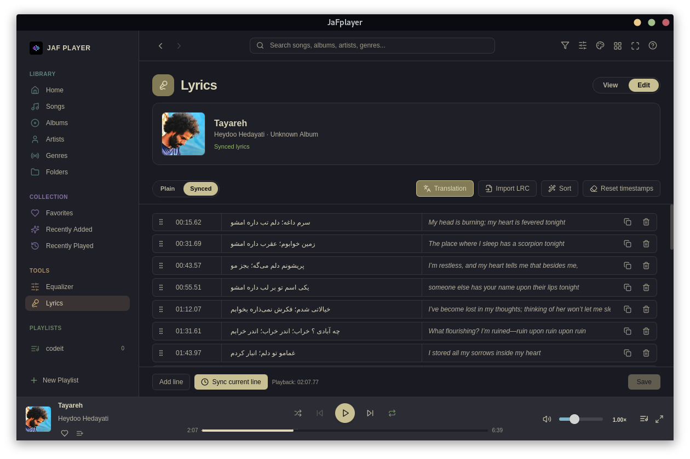
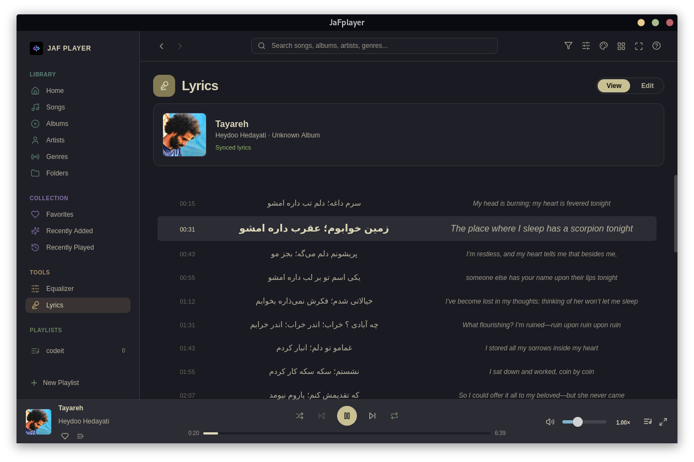

# JaFplayer

A modern, lightweight, and customizable desktop audio player designed for Linux.

Built with **Tauri v2**, **React**, and **Tailwind CSS**, JaFplayer combines native OS performance with a fluid user interface.

## Screenshots

| Main Library & Player | Theme Customization |
| --------------------- | ------------------- |
|  |  |

| Built-in Audio Equalizer | Tag & Metadata Editor |
| ------------------------ | --------------------- |
|  |  |

| Mini Player Mode | Playlist |
| ---------------- | -------- |
|  |  |

| Lyrics Editor | Synced Lyrics |
| ------------- | ------------- |
|  |  |

---

## Features

### Playback & Core Functionality

* **Continue Playing**: Remembers and automatically resumes your last playback position, queue, and state when launched.
* **Granular Speed Controls**:
  * **Global Speed**: Set a default playback speed for all tracks via Settings.
  * **Per-Track Speed**: Adjust speed on the fly via the PlayBar or Now Playing view without changing global settings.
* **Mini Player**: A compact floating interface with essential playback controls and artwork.
* **System Integration**: Works as the default handler for audio files on Linux.
* **Favorites**: Quickly add or remove the current track from Favorites from the PlayBar, Now Playing, or tray panel.
* **Playlists**: Add tracks to playlists directly from the PlayBar and Now Playing.
* **Global Search**: Search from any page in the application.

### Audio Equalizer

* **Smart Auto Mode**: Reads the genre metadata from your audio files and automatically applies a matching EQ preset.
* **Multi-band EQ Visualizer**: Custom frequency visualizer and Preamp adjustments.
* **Presets & Customization**: Includes standard presets such as Vocal Boost, Rock, Jazz, and Pop, with support for creating, saving, and exporting custom EQ profiles.

### Personalization & Themes

* **Built-in Color Palettes**: Includes themes such as Kanagawa, Tokyo Night, Catppuccin Mocha, Nord, Gruvbox Dark, One Dark, Night Owl, Argonaut, and more.
* **Gogh Theme Import**: Import Gogh `.yml` theme files directly into JaFplayer.
* **Theme Import / Export**: Edit hex values and import/export themes via JSON format.

### Library & Tag Editor

* **Metadata Management**: Edit track title, artist, album, genre, release year, track/disc numbers, and custom credits.
* **Cover Art Management**: Update or remove embedded artwork easily.
* **Library Organization**: Categorizes audio by Songs, Albums, Artists, Genres, Folders, and custom Playlists.

### Lyrics

JaFplayer includes a complete workflow for creating, editing, syncing, and enjoying lyrics.

* **Metadata Lyrics**: Load lyrics directly from the song's metadata.
* **Two Editing Modes**:
  * **Plain Text**: Edit the lyrics as regular text.
  * **Synced**: Synchronize lyrics line by line with the song.
* **Live Synchronization**: Synced lyrics automatically highlight the current line during playback.
* **Easy Sync**: Write or paste lyrics in Plain Text mode, switch to Synced mode, play the song, and use **Sync current line** as each line is sung.
* **Per-Line Translation**: Add an optional translation for each lyric line.
* **LRC Import**: Import `.lrc` lyric files directly into the lyrics panel.
* **Metadata Saving**: Save edited lyrics back into the music file's metadata.
* **View Mode**: Switch from editing to a clean lyrics viewing experience.
* **Seek from Lyrics**: Click any synced lyric line in View Mode to seek to its timestamp and continue playback.
* **Now Playing Lyrics**: Toggle between the normal Now Playing view and Lyrics mode.
* **Tray Access**: Open the lyrics tool directly from the tray panel.

---

## Performance

Version **v0.3.0** focused entirely on making JaFplayer lighter, faster, and more responsive. Compared with v0.2.2, the release benchmark reported:

| Metric | v0.2.2 | v0.3.0 | Change |
| ------ | -----: | -----: | -----: |
| Idle RAM | 248 MB | 185 MB | −25% |
| Idle CPU (single core) | 3.51% | 2.57% | −27% |
| Active RAM (steady) | 574 MB | 506 MB | −12% |
| Active CPU (single core) | 89.5% | 65.6% | −27% |
| Active CPU peak (single core) | 212% | 132% | −38% |

Additional performance work included:

* Faster initial library scanning — approximately 1,000 tracks in approximately 1 second.
* Optimizations to hashing, compression, IPC, and resource usage.
* Reduced the delay between pressing Pause and audio actually stopping.
* Further minor optimizations were added in v0.3.2.

---

## Linux Compatibility

JaFplayer v0.3.1 fixed tray panel ghosting and rendering issues on **WebKitGTK 2.46 and newer**. The fix applies automatically on supported versions.

For **WebKitGTK 2.44 or older**, you can continue using v0.3.0 or use one of the following v0.3.1 workarounds:

### Per-launch

```bash
WEBKIT_DISABLE_DMABUF_RENDERER=1 jafplayer
```

### JaFplayer-specific

```bash
JAFPLAYER_DISABLE_DMABUF=1 jafplayer
```

### Permanent marker file

```bash
mkdir -p ~/.config/jafplayer
touch ~/.config/jafplayer/disable-dmabuf
```

To remove the marker-file workaround:

```bash
rm ~/.config/jafplayer/disable-dmabuf
```

---

## Configuration

JaFplayer stores its configuration and user settings locally at:

```bash
~/.config/jafplayer/
```

---

## Tech Stack

* **Framework**: [Tauri v2](https://tauri.app/)
* **Frontend**: [React](https://react.dev/)
* **Styling**: [Tailwind CSS](https://tailwindcss.com/)
* **Target Platform**: Linux

---

## Installation & Releases

Pre-built binaries are available for `Linux` and `Windows` on the [Releases](../../releases) page.

Supported Linux package formats include:

* `.deb` (Debian / Ubuntu based)
* `.rpm` (Fedora / RHEL / openSUSE)
* `.pkg.tar.zst` (Arch Linux / Manjaro)

### Installation Example (Debian/Ubuntu)

```bash
sudo dpkg -i jafplayer_<version>_amd64.deb
```

---

## License

Distributed for binary releases. All rights reserved by the author.
