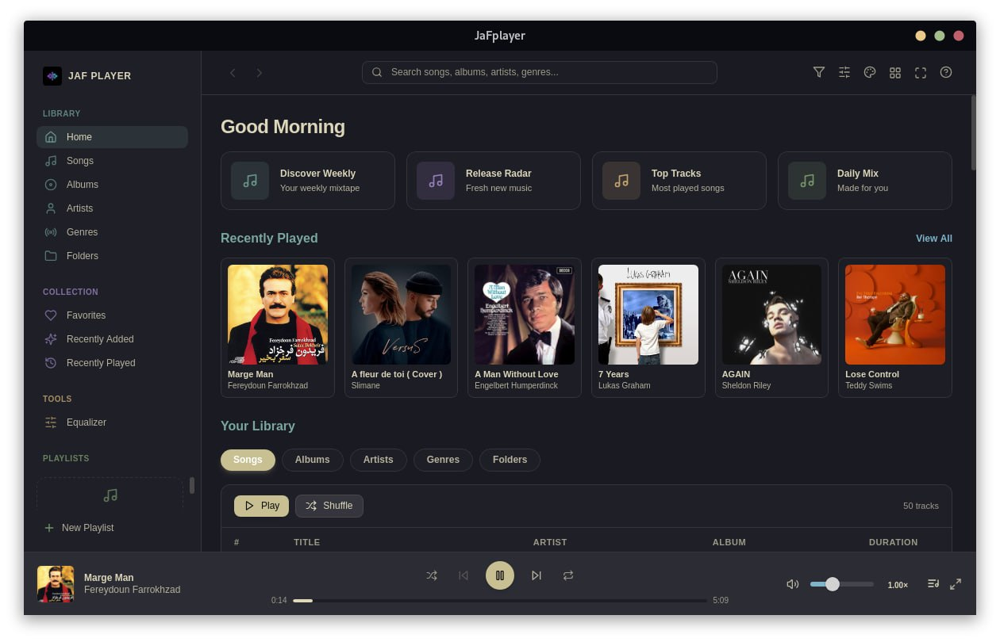
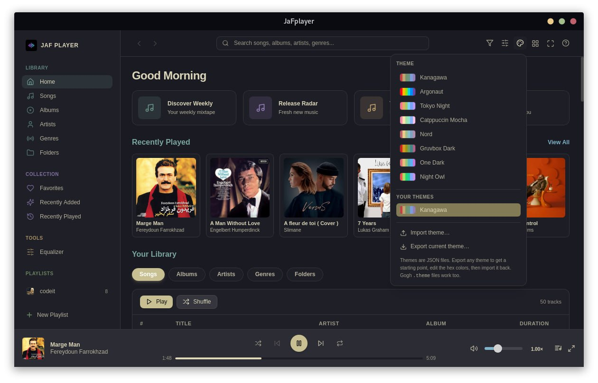
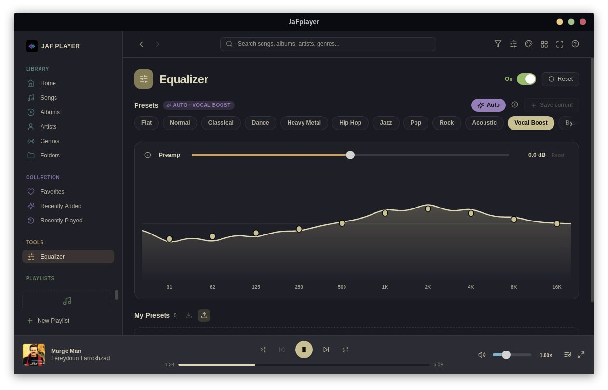
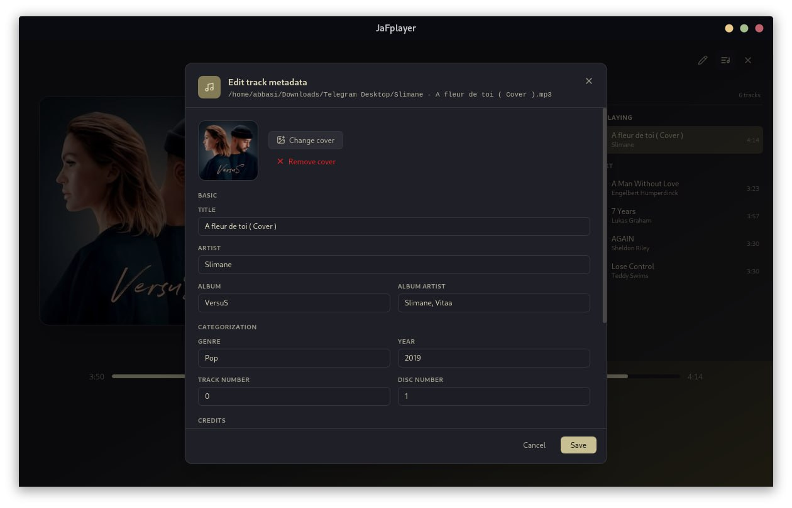
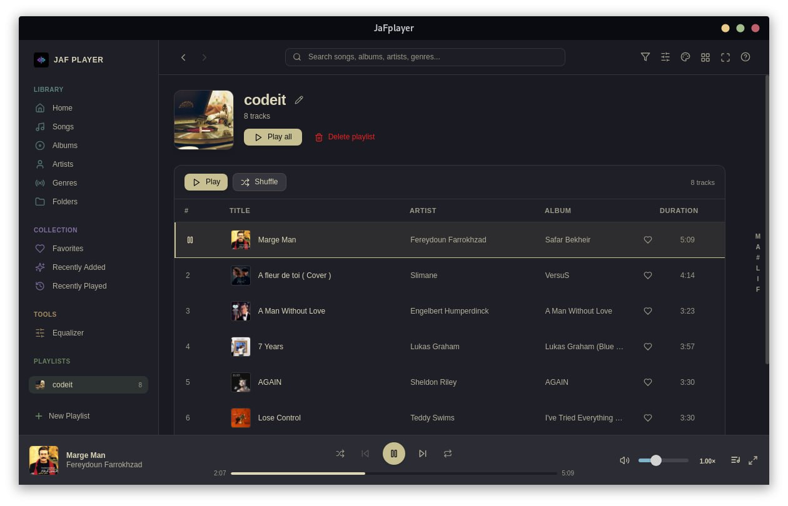

# JaFplayer

A modern, lightweight, and customizable desktop audio player designed for Linux.

Built with **Tauri v2**, **React**, and **Tailwind CSS**, JaFplayer combines native OS performance with a fluid user interface.

---

## Features

### Playback & Core Functionality

* **Continue Playing**: Remembers and automatically resumes your last playback position, queue, and state when launched.
* **Granular Speed Controls**:
  * **Global Speed**: Set a default playback speed for all tracks via Settings.
  * **Per-Track Speed**: Adjust speed on the fly via the Playbar or Now Playing view without changing global settings.
* **Mini Player**: A compact floating interface with essential playback controls and artwork.
* **System Integration**: Works as the default handler for any audio file format on Linux.

### Audio Equalizer

* **Smart Auto Mode**: Reads the genre metadata from your audio files and automatically applies a matching EQ preset.
* **Multi-band EQ Visualizer**: Custom frequency visualizer and Preamp adjustments.
* **Presets & Customization**: Includes standard presets (Vocal Boost, Rock, Jazz, Pop, etc.) with support for creating, saving, and exporting custom EQ profiles.

### Personalization & Themes

* **Built-in Color Palettes**: Includes themes such as Kanagawa, Tokyo Night, Catppuccin Mocha, Nord, Gruvbox Dark, One Dark, Night Owl, Argonaut, and more.
* **Theme Import / Export**: Edit hex values and import/export themes via JSON format.

### Library & Tag Editor

* **Metadata Management**: Edit track title, artist, album, genre, release year, track/disc numbers, and custom credits.
* **Cover Art Management**: Update or remove embedded artwork easily.
* **Library Organization**: Categorizes audio by Songs, Albums, Artists, Genres, Folders, and custom Playlists.

---

## Configuration

JaFplayer stores its configuration and user settings locally at:

```bash
~/.config/jafplayer/
```

---

## Screenshots

| Main Library & Player | Theme Customization |
| --------------------- | ------------------- |
|  |  |

| Built-in Audio Equalizer             | Tag & Metadata Editor                   |
| ------------------------------------ | --------------------------------------- |
|  |  |

| Mini Player Mode                        | Playlist                                                     |
| --------------------------------------- | ------------------------------------------------------------ |
|  |  |

---

## Tech Stack

* **Framework**: [Tauri v2](https://tauri.app/)
* **Frontend**: [React](https://react.dev/)
* **Styling**: [Tailwind CSS](https://tailwindcss.com/)
* **Target Platform**: Linux

---

## Installation & Releases

Pre-built binaries are available for Linux on the [Releases](../../releases) page. Supported package formats include:

* `.deb` (Debian / Ubuntu based)
* `.rpm` (Fedora / RHEL / openSUSE)
* `.pkg.tar.zst` (Arch Linux / Manjaro)

### Installation Example (Debian/Ubuntu)
```bash
sudo dpkg -i jafplayer_<version>_amd64.deb
```

---

## License

Distributed for binary releases. All rights reserved by the author.